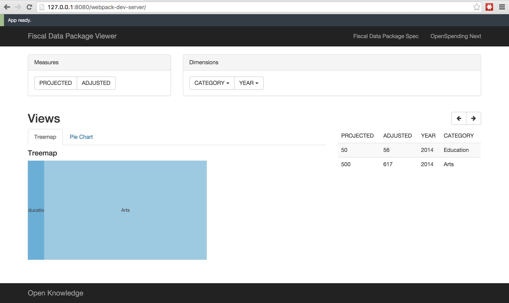

# Fiscal Data Package Viewer

A frontend data/views app powered directly from a Fiscal Data Package.
http://borysyuk.github.io/fiscal-data-package-viewer/

## Get started

```
git clone https://github.com/openspending/fiscal-data-package-viewer.git
npm install
npm run develop
open http://127.0.0.1:8080/webpack-dev-server/
```

## How it looks

We'll update the screenshot as development progresses.

*24/11/2015*: generate basic ui based on a mock state tree for the data, as initial POC.

 
